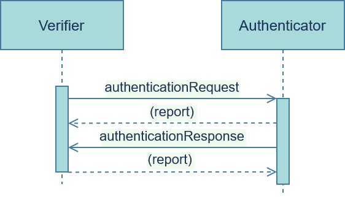

# authentication

Proving control over an identifier.

The authentication flow consists of a simple request-response message exchange, where the contents of the response must match those of the request. Because all messages are signed and authenticated, the response functions as proof of control by nature of being correctly signed by the keys listed in the DID Document of the issuer. Because of this, in scenarios where a more complex functionality (e.g. Credential Verification) is needed, an additional authentication flow is not necessary.

### Roles
- <u>**Verifier**</u>: Agent who requests and verifies the authenticity of the <u>authenticator</u>
- <u>**Authenticator**</u>: Agent who proves control over their identifier

### Flow



### Messages

#### authenticationRequest
The <u>verifier</u> sends the `authenticationRequest` to the authentication service endpoint of the <u>authenticator</u>, specifying a `callbackURL` for the `authenticationResponse` to be posted to. The whole request is to be signed by the <u>authenticator</u>. 

###### Layout

```JSON
authenticationRequest: {
    "context", // REQUIRED!
    "thread", // REQUIRED!
    "callbackURL", // REQUIRED!
    "challenge", // REQUIRED!
    "responseRequested", //OPTIONAL!
    "id", // OPTIONAL!
    "timing" // OPTIONAL!
}
```

###### Example(s)

```JSON
{
    "context": "authentication/1.0/authenticationRequest",
    "thread": "936DA01F9ABD4d9d80C702AF85C822A8",
    "callbackURL": "https://www.bobsworld.com/",
    "challenge": "Sign this!",
    "id": "did:iota:57edacef81828010b314b96c0915780f206341e0ce8892a1b56678c174eef2e8",
    "timing": {
        "out_time": "1991-04-20T13:37:11Z",
        "expires_time": "2069-04-20T13:37:02Z",
        "wait_until_time": "2069-04-20T13:37:00Z"
    }
}
```

#### authenticationResponse
The <u>authenticator</u> answers with an `authenticationResponse`, providing a `signature` of the whole `authenticationRequest` JSON - the complete original `authenticationRequest`.

###### Layout

```JSON
authenticationResponse: {
    "context", // REQUIRED!
    "thread", // REQUIRED!
    "signature", // REQUIRED!
    "callbackURL", // OPTIONAL!
    "responseRequested", //OPTIONAL!
    "id", // OPTIONAL!
    "timing" // OPTIONAL!
}
```

###### Example(s)

```JSON
{
    "context": "authentication/1.0/authenticationResponse",
    "thread": "936DA01F9ABD4d9d80C702AF85C822A8",
    "signature": {
        "type": "JcsEd25519Signature2020",
        "verificationMethod": "did:iota:42edacef81828010b314b96c0915780f206341e0ce8892a1b56678c174eef242#authentication",
        "signatureValue": "5Hw1JWv4a6hZH5obtAshbbKZQAJK6h8YbEwZvdxgWCXSL81fvRYoMCjt22vaBtZewgGq641dqR31C27YhDusoo4N"
   },
   "callbackURL": "https://www.aliceswonderland.com/",
   "id": "did:iota:42edacef81828010b314b96c0915780f206341e0ce8892a1b56678c174eef242",
}
```

The `signature` provided here must correspond to the `#authentication` public key provided in the DID Document of the identity that the <u>verifier</u> has received earlier. If that is the case, the identifier is authenticated successfully.

[Source 1: Jolocom Authentication](https://jolocom.github.io/jolocom-sdk/1.0.0/guides/interaction_flows/#authentication);
