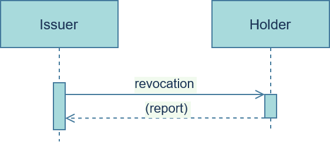

# credential-revocation

Notifying a holder that a previously issued credential has been revoked. Note that this revocation is declaratory, not constitutive, so the actual revocation has to be done elsewhere (e.g. in the backend of the issuer).

### Roles
- <u>**Issuer**</u>: Agent who revokes the credential
- <u>**Holder**</u>: Agent who holds the credential to be revoked

### Flow



### Messages

#### revocation
The <u>issuer</u> sends the `revocation` to the <u>holder</u>, notifying him of the revocation. The most important field here is `credentialId`, which specifies the credential that has been revoked.

###### Layout

```JSON
revocation: {
    "context", // REQUIRED!
    "thread", // REQUIRED!
    "credentialId", // REQUIRED!
    "callbackURL", // OPTIONAL!
    "responseRequested", //OPTIONAL!
    "id", // OPTIONAL!
    "comment", // OPTIONAL!
    "timing" // OPTIONAL!
}
```


###### Example(s)

```JSON
{
    "context": "credential-revocation/1.0/revocation",
    "thread": "936DA01F9ABD4d9d80C702AF85C822A8",
    "credentialId": "credential-69420-delicious-lasagna",
    "callbackURL": "https://www.aliceswonderland.com/",
    "id": "did:iota:42edacef81828010b314b96c0915780f206341e0ce8892a1b56678c174eef242",
    "comment": "Revoked because your Lasagna isn't actually that good."
}
```

[Source 1: Aries Revocation Notification](https://github.com/hyperledger/aries-rfcs/tree/master/features/0183-revocation-notification);