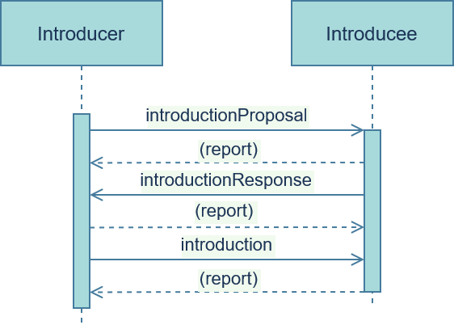

# did-introduction

Describes how a go-between can introduce two parties that it already knows, but that do not know each other.

### Roles
- <u>**Introducer**</u>: Agent who introduces multiple <u>introducee</u>s to each other
- <u>**Introducee**</u>: Two agents that are introduced to each other through the <u>introducer</u>

Note that we have two roles here, but three agents.

The ´comment´ field can be used to provide a rationale for the introduction, however, that only matters for humans, not for e.g. IoT devices. A rationale for devices would need to be standardized.

When one of the <u>introducee</u>s denies the proposal and the other accepts, then the accepting party will know about the other party having denied the request, since it will not be followed through. This is akin to somebody denying a social media friend request and might pose somewhat of a privacy risk.

### Flow



### Messages

#### introductionProposal
The <u>introducer</u> sends the `introductionProposal` to every <u>introducee</u>, asking for their consent to the introduction.

###### Layout

```JSON
introductionProposal: {
    "context", // REQUIRED!
    "thread", // REQUIRED!
    "callbackURL", // REQUIRED!
    "responseRequested", //OPTIONAL!
    "id", // OPTIONAL!
    "comment", // OPTIONAL!
    "timing" // OPTIONAL!
}
```

###### Example(s)

```JSON
{
    "context": "did-introduction/1.0/introductionProposal",
    "thread": "936DA01F9ABD4d9d80C702AF85C822A8",
    "callbackURL": "https://www.bobsworld.com/"
}
```

#### introductionResponse
The <u>introducee</u>s answer with a `introductionResponse`, signaling their consent.

###### Layout

```JSON
introductionResponse: {
    "context", // REQUIRED!
    "thread", // REQUIRED!
    "consent", // REQUIRED!
    "callbackURL", // OPTIONAL!
    "responseRequested", // OPTIONAL!
    "id", // OPTIONAL!
    "comment", // OPTIONAL!
    "timing" // OPTIONAL!
}
```

###### Example(s)

```JSON
{
    "context": "did-introduction/1.0/introductionResponse",
    "thread": "936DA01F9ABD4d9d80C702AF85C822A8",
    "consent": true
}
```

#### introduction
The <u>introducer</u> finishes with a series of `introduction` messages, introducing all <u>introducee</u>s that consented to each other.

###### Layout

```JSON
introduction: {
    "context", // REQUIRED!
    "thread", // REQUIRED!
    "ids", // REQUIRED!
    "callbackURL", // OPTIONAL!
    "responseRequested", // OPTIONAL!
    "id", // OPTIONAL!
    "comment", // OPTIONAL!
    "timing" // OPTIONAL!
}
```

###### Example(s)

```JSON
{
    "context": "did-introduction/1.0/introduction",
    "thread": "936DA01F9ABD4d9d80C702AF85C822A8",
    "ids": [
        "did:iota:57edacef81828010b314b96c0915780f206341e0ce8892a1b56678c174eef2e8",
        "did:iota:bg73b4g8734b59g8beriugb9e87gh854giu3b54g09e8gh3othg9ewhg8we7ghb4"
    ]
}
```

[Source 1: Aries Introduce Protocol](https://github.com/hyperledger/aries-rfcs/blob/master/features/0028-introduce/README.md);